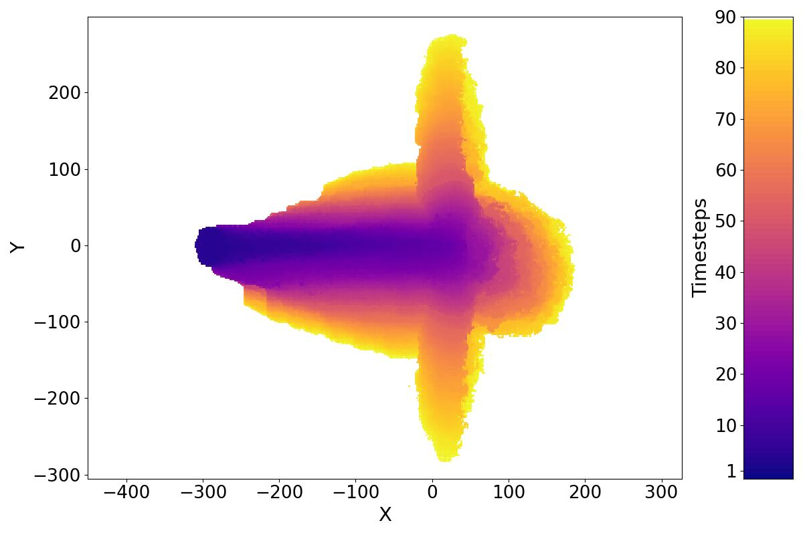

# Vorticity-Driven Lateral Spread Wildfire Dataset (LA-UR-21-30892)

[](https://creativecommons.org/licenses/by/4.0/)

```
XX              XXXXX XXX         XX XX           XX       XX XX XXX         XXX
XX             XXX XX XXXX        XX XX           XX       XX XX    XX     XX   XX
XX            XX   XX XX XX       XX XX           XX       XX XX      XX XX       XX
XX           XX    XX XX  XX      XX XX           XX       XX XX      XX XX       XX
XX          XX     XX XX   XX     XX XX           XX XXXXX XX XX      XX XX       XX
XX         XX      XX XX    XX    XX XX           XX       XX XX     XX  XX
XX        XX       XX XX     XX   XX XX           XX       XX XX    XX   XX
XX       XX XX XX XXX XX      XX  XX XX           XX XXXXX XX XX XXX     XX       XX
XX      XX         XX XX       XX XX XX           XX       XX XX         XX       XX
XX     XX          XX XX        X XX XX           XX       XX XX         XX       XX
XX    XX           XX XX          XX XX           XX       XX XX          XX     XX
XXXX XX            XX XX          XX XXXXXXXXXX   XX       XX XX            XXXXXX
```

This dataset was created by converting an existing LANL FireTec VLS dataset (LA-UR-21-30892) from its original VTK format to Parquet. It contains 90 Parquet files, each representing the state of a specific simulation timestep—from timestep 1000 to 91000 (excluding 50000 which is missing). Every file has the same structure: 18,300,000 rows (split into 6 row groups) and 5 columns—`rowid`, `rhof_1`, `x`, `y`, and `z`. The `rhof_1` column stores the bulk density of dry fuel in kilograms per cubic meter (kg/m3), while `x`, `y`, and `z` record the 3D coordinates of each data point. All files were compressed with Brotli at level 9 (`brotli -9`) before being uploaded to GitHub.

To recover a parquet file from its brotli compressed form:

```bash
brotli -d <parquet_file>.br
```

For example:

```bash
brotli -d output.1000.parquet.br
```

On Ubuntu, brotli can be installed through APT:

```bash
sudo apt-get install brotli
```

# Schema and Statistics

See below for a quick metadata dump for one of the parquet data files: `output.1000.parquet`.

```
File path:  output.1000.parquet
Created by: parquet-cpp-arrow version 20.0.0
Properties: (none)
Schema:
message schema {
  required int32 rowid (INTEGER(32,true));
  required float rhof_1;
  required float x;
  required float y;
  required float z;
}


Row group 0:  count: 3050000  20.00 B records  start: 4  total(compressed): 58.174 MB total(uncompressed):58.174 MB 
--------------------------------------------------------------------------------
        type      encodings count     avg size   nulls   min / max
rowid   INT32     _   _     3050000   4.00 B     0       "0" / "3049999"
rhof_1  FLOAT     _   _     3050000   4.00 B     0       "1.0E-6" / "0.6"
x       FLOAT     _   _     3050000   4.00 B     0       "-498.0" / "700.0"
y       FLOAT     _   _     3050000   4.00 B     0       "-500.0" / "498.0"
z       FLOAT     _   _     3050000   4.00 B     0       "0.75045353" / "206.3463"

Row group 1:  count: 3050000  20.00 B records  start: 61000134  total(compressed): 58.174 MB total(uncompressed):58.174 MB 
--------------------------------------------------------------------------------
        type      encodings count     avg size   nulls   min / max
rowid   INT32     _   _     3050000   4.00 B     0       "3050000" / "6099999"
rhof_1  FLOAT     _   _     3050000   4.00 B     0       "-0.0" / "0.6"
x       FLOAT     _   _     3050000   4.00 B     0       "-498.0" / "700.0"
y       FLOAT     _   _     3050000   4.00 B     0       "-500.0" / "498.0"
z       FLOAT     _   _     3050000   4.00 B     0       "19.94993" / "239.64423"

Row group 2:  count: 3050000  20.00 B records  start: 122000264  total(compressed): 58.174 MB total(uncompressed):58.174 MB 
--------------------------------------------------------------------------------
        type      encodings count     avg size   nulls   min / max
rowid   INT32     _   _     3050000   4.00 B     0       "6100000" / "9149999"
rhof_1  FLOAT     _   _     3050000   4.00 B     0       "-0.0" / "0.0"
x       FLOAT     _   _     3050000   4.00 B     0       "-498.0" / "700.0"
y       FLOAT     _   _     3050000   4.00 B     0       "-500.0" / "498.0"
z       FLOAT     _   _     3050000   4.00 B     0       "62.006165" / "308.27396"

Row group 3:  count: 3050000  20.00 B records  start: 183000394  total(compressed): 58.174 MB total(uncompressed):58.174 MB 
--------------------------------------------------------------------------------
        type      encodings count     avg size   nulls   min / max
rowid   INT32     _   _     3050000   4.00 B     0       "9150000" / "12199999"
rhof_1  FLOAT     _   _     3050000   4.00 B     0       "-0.0" / "0.0"
x       FLOAT     _   _     3050000   4.00 B     0       "-498.0" / "700.0"
y       FLOAT     _   _     3050000   4.00 B     0       "-500.0" / "498.0"
z       FLOAT     _   _     3050000   4.00 B     0       "148.6875" / "429.47055"

Row group 4:  count: 3050000  20.00 B records  start: 244000524  total(compressed): 58.174 MB total(uncompressed):58.174 MB 
--------------------------------------------------------------------------------
        type      encodings count     avg size   nulls   min / max
rowid   INT32     _   _     3050000   4.00 B     0       "12200000" / "15249999"
rhof_1  FLOAT     _   _     3050000   4.00 B     0       "-0.0" / "0.0"
x       FLOAT     _   _     3050000   4.00 B     0       "-498.0" / "700.0"
y       FLOAT     _   _     3050000   4.00 B     0       "-500.0" / "498.0"
z       FLOAT     _   _     3050000   4.00 B     0       "301.76227" / "620.469"

Row group 5:  count: 3050000  20.00 B records  start: 305000654  total(compressed): 58.174 MB total(uncompressed):58.174 MB 
--------------------------------------------------------------------------------
        type      encodings count     avg size   nulls   min / max
rowid   INT32     _   _     3050000   4.00 B     0       "15250000" / "18299999"
rhof_1  FLOAT     _   _     3050000   4.00 B     0       "-0.0" / "0.0"
x       FLOAT     _   _     3050000   4.00 B     0       "-498.0" / "700.0"
y       FLOAT     _   _     3050000   4.00 B     0       "-500.0" / "498.0"
z       FLOAT     _   _     3050000   4.00 B     0       "542.99884" / "898.50433"

```

# Sample SQL Query

One type of analysis we can perform is tracking how the fire spreads over time. This can be done by comparing dry fuel levels (`rhof_1`) between consecutive timesteps—for example, comparing timestep 1 to 2, 2 to 3, and so on. A decrease in `rhof_1` at a location indicates that the fire has reached that area. The following SQL query illustrates this comparison for each timestep pair:

```sql
SELECT x,y FROM
  (
    SELECT rowid,x,y,rhof_1
    FROM 'output.<timestep i>.parquet'
    WHERE rhof_1>1e-06
  ) a
LEFT JOIN
  (
    SELECT rowid,rhof_1
    FROM 'output.<timestep i+1>.parquet'
    WHERE rhof_1>1e-06
  ) b USING (rowid)
WHERE b.rhof_1 is null OR a.rhof_1>b.rhof_1
```

The SQL query returns a list of `x`-`y` coordinates showing all locations the fire has reached at timestep *i*—identified as places where the dry fuel level (`rhof_1`) has decreased (`a.rhof_1 > b.rhof_1`). To compute this, we join two tables: one from timestep *i* and one from timestep *i+1*. For each timestep *i*, we filter out points with no fuel by selecting only rows where `rhof_1 > 1e-06`.

**Note:** This SQL query can naturally be broken down into two subqueries—one for each timestep—followed by a left outer join. In a multilevel computational storage environment, the two subqueries could be pushed down to the lowest tier, with the join performed at an intermediate level. In this dataset, each subquery filters out roughly 90% of the data, while the join and post-join condition (`a.rhof_1 > b.rhof_1`) yield a final selectivity of about 0.001%.

The above SQL is written using the DuckDB syntax.

# Sample Result

The following plot shows how the fire spreads over time, based on results from running the above queries across all timesteps.



# Acknowledgement

Wildfire behavior is a result of complex nonlinear interactions between a variety of physical processes and chemical reactions. Understanding the coupling between these components and the ways in which their interactions are influenced by their surrounding environment (e.g. winds, fuels, and topography) is a challenging undertaking. Check this [report](report.pdf) for more information about this dataset and this [paper](https://doi.org/10.1109/MCG.2023.3310298) for the specific analysis we used for this sample dataset.

[DuckDB](https://duckdb.org/) is an open source high-performance analytical database system.

This sample dataset is prepared by an employee of Triad National Security, LLC which operates Los Alamos National Laboratory for the U.S. Department of Energy/National Nuclear Security Administration.

